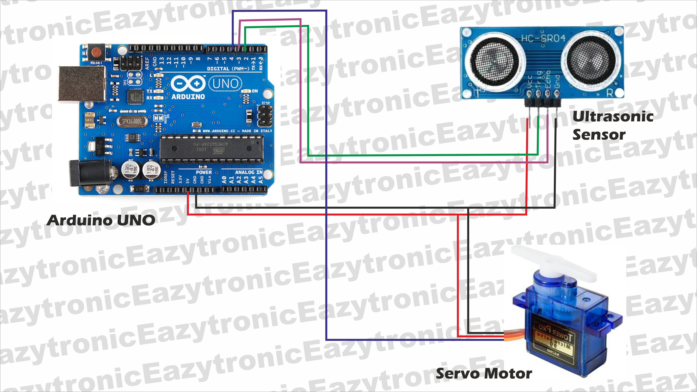

<h1>
  
  **Arduino Project**
  
</h1>
Automated garage door

Tugas ujian praktek fisika menggunakan arduino
<h3>
  Getting Started
  </h3>
  <li>Download kode</li>
  <li>Library</li>
  <li>Mencari port dan board</li>
  <li>Diagram circuit</li>

  <h3>Download kode</h3>
  
Langkah pertama adalah mendownload kode

  
  1. Klik sketch_jan31a.ino  
  2. Klik Download rawcode/ copy rawcode  
  3. Masuk ke arduino IDE dan paste kode/buka sketch dengan file yang telah di downlaod
  

  <h3>
    Library
  </h3>
  
Mendownload library untuk servo motor

  
    1. Navigasi ke bagian kiri layar dan klik Library Manager  
    2. Cari Servo by Michael  
    3. Pilih Install All
  

  <h3>
    Mencari port dan board
  </h3>
  
Pastikan Driver sudah terintall untuk port, yang biasanya secara otomatis terunduh dengan Arduino IDE  
    

    
 > Untuk board clone biasanya menggunakan driver *CH340* dan harus mengunduh driver secara manual 

   Cara unduh Driver secara manual  
   https://docs.arduino.cc/tutorials/generic/DriverInstallation/  

  1. Hubungkan board ke komputer menggunakan USB Cable  
  2. Pilih PORT contoh: (COM 3, COM8)  
  3. Pilih Board Arduino UNO  
  4. Upload Sketch  

<h3>Diagram Sirkuit</h3>  

Gamabr Diagram sirkuit  
Credit to EAZYTRONIC on Youtube

  
  
